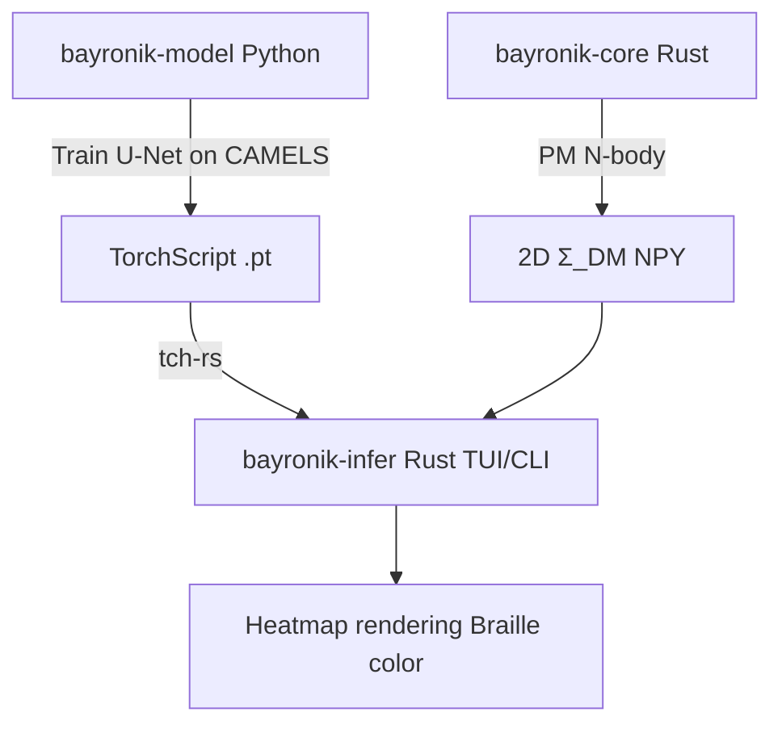

# Bayronik: Field-Level Baryonic Emulator for Weak Lensing

High-performance, multi-fidelity emulation of baryonic effects directly at the map level. Bayronik couples a Rust N-body particle–mesh (PM) simulator with a PyTorch U-Net, delivering realistic 2D matter maps without running full hydrodynamics.


## Overview

Bayronik targets the dominant systematics in weak-lensing analyses: baryonic feedback (AGN, supernovae) redistributing mass on kpc–Mpc scales. It provides fast, field-level corrections by learning a mapping from gravity-only fields to total-matter fields. This enables forward modeling, survey forecasts, and the use of higher-order map statistics beyond the power spectrum.

Documentation:
- GUIDE: see [GUIDE.md](GUIDE.md) for the TUI visualization guide
- This README: setup, architecture, and data access

## Architecture



Guiding principles (equations):

$$ \nabla^2 \phi = 4\pi G, \rho, \qquad \mathbf{F} = -\nabla \phi $$

Time integration (Kick–Drift–Kick):

$$ \mathbf{v}^{n+1/2} = \mathbf{v}^n + \tfrac{\Delta t}{2} \mathbf{F}^n, \quad \mathbf{x}^{n+1} = \mathbf{x}^n + \Delta t,\mathbf{v}^{n+1/2}, \quad \mathbf{v}^{n+1} = \mathbf{v}^{n+1/2} + \tfrac{\Delta t}{2} \mathbf{F}^{n+1}. $$

Initial conditions are clustered by sampling particles from a Fourier-synthesized density field with amplitudes $ A_k \propto k^{-1/2} $ (a compact proxy for $P(k)$). We project to 2D surface density $\Sigma$ using Cloud-in-Cell (CIC), apply a stable log1p transform, and perform inference with a TorchScript U-Net.

Initial conditions are clustered by sampling particles from a Fourier-synthesized density field with amplitudes \( A_k \propto k^{-1/2} \) (a compact proxy for \(P(k)\)). We project to 2D surface density \(\Sigma\) using Cloud-in-Cell (CIC), apply a stable log1p transform, and perform inference with a TorchScript U-Net.

## Quick Start

Prerequisites:
- Rust (1.70+)
- Python 3.9+ with PyTorch
- LibTorch available via the installed PyTorch (used by tch-rs)

Install and prepare:
```bash
# Clone
git clone https://github.com/yourusername/bayronik.git
cd bayronik

# Python env for training and LibTorch
cd bayronik-model
python -m venv .venv
source .venv/bin/activate
pip install -r requirements.txt
```

Train and export the model (optional if you already have weights):
```bash
cd bayronik-model
source .venv/bin/activate
python train.py
python exporter.py  # produces weights/traced_unet_model.pt
```

Run the TUI (inference and visualization):
```bash
cd bayronik-infer
source ../bayronik-model/.venv/bin/activate
export DYLD_LIBRARY_PATH=$(python -c "import torch, os; print(os.path.join(os.path.dirname(torch.__file__), 'lib'))")
export LIBTORCH_USE_PYTORCH=1
cargo run --release
```

Alternatively, use the launcher:
```bash
./run_bayronik.sh
```

TUI controls:
- Right/Left arrows or n/p: navigate simulations
- r: random sample
- g: generate on-the-fly N-body map (bayronik-core)
- c: switch back to CAMELS maps
- q: quit

## Data

Primary training/inference inputs are 2D projected maps in NPY format from CAMELS (IllustrisTNG suite). Place files under `bayronik-model/data/`:
- `Maps_Mcdm_IllustrisTNG_*_z=0.00.npy` (dark matter)
- `Maps_Mtot_IllustrisTNG_*_z=0.00.npy` (total matter)

You may optionally use 3D hydrodynamical snapshots (HDF5) from the data portals when you need custom projections or power-spectrum calibration. Reference: IllustrisTNG Project [tng-project.org](https://www.tng-project.org/).

## Physics and Numerics

- Mass assignment: CIC to grid nodes.
- Poisson solver: FFT in k-space, \( \hat{\phi}(\mathbf{k}) = -\hat{\delta}(\mathbf{k}) / k^2 \).
- Forces: centered differences, with a tunable growth amplification to mimic late-time structure formation.
- Integrator: symplectic Kick–Drift–Kick with periodic boundaries.
- Projection: 3D → 2D via CIC along the line of sight.

We stabilize the dynamic range using \( \log(1 + \Sigma) \) and match global statistics (mean/variance) to CAMELS to keep inference in-distribution.

## Visualization

The TUI renders high-fidelity heatmaps using Unicode Braille characters (8× subcell resolution) and a perceptually tuned blue→red gradient. Three synchronized panels are shown: input (gravity-only), output (total matter), and baryonic residual \(\Delta\). The title bars display live statistics (mean, standard deviation, min, max).

## Repository Layout

```
bayronik/
├── bayronik-core/      # Rust N-body (PM): CIC, FFT Poisson, KDK
├── bayronik-infer/     # Rust TUI/CLI: tch-rs inference, heatmaps
├── bayronik-model/     # Python training: U-Net, export to TorchScript
└── GUIDE.md            # TUI visualization guide
```

## References

- CAMELS dataset: Villaescusa-Navarro et al., 2022 (arXiv:2109.10915)
- Field-level emulation: Jamieson et al., 2022 (arXiv:2207.05202)
- Baryonic corrections: Sharma et al., 2023 (MNRAS 526, 3396)
- Multi-fidelity ML: Ho et al., 2021 (arXiv:2105.01081)
- IllustrisTNG Project: [tng-project.org](https://www.tng-project.org/)

## License

MIT License
 
## Acknowledgments

- CAMELS Collaboration and the Flatiron Institute
- IllustrisTNG team for public data and documentation
- tch-rs and ratatui projects

Status: research prototype (v0.1.0-alpha)  
Contact: yuvrajbiswalofficial@gmail.com  
Last updated: October 2025

